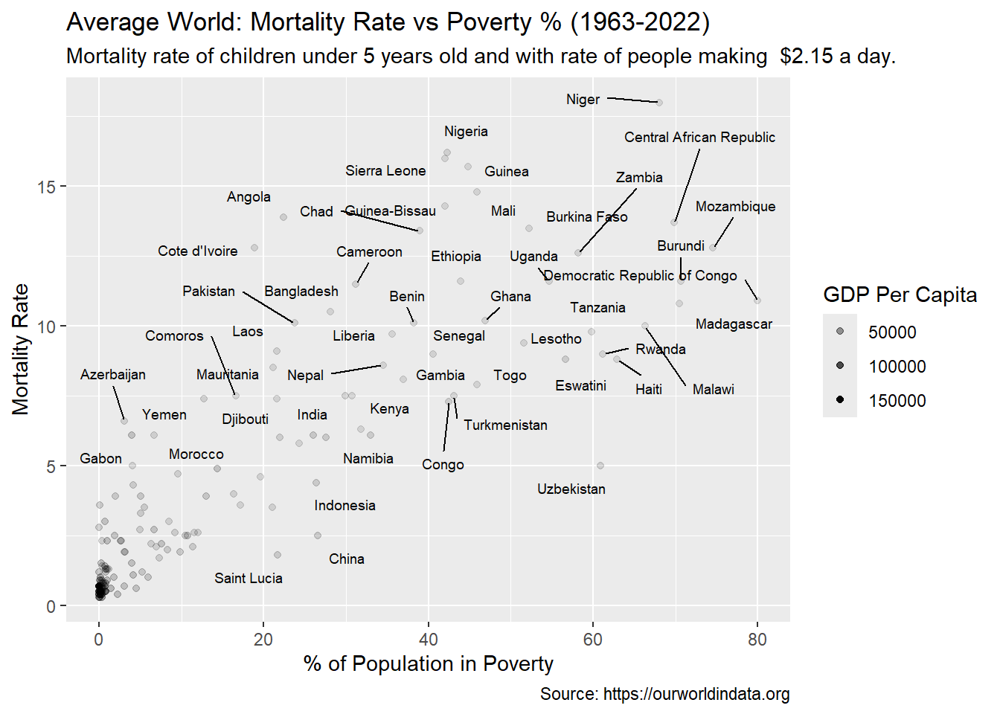
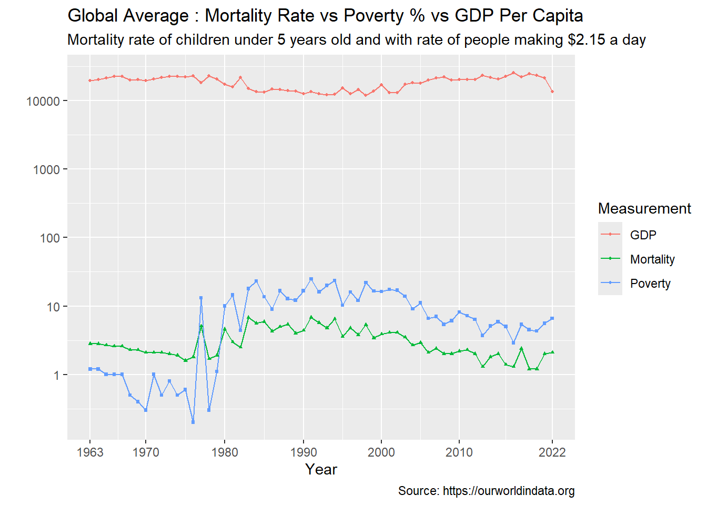

# Overview

Mortality is known as the death rate, the measurement of the number of deaths within units of time relative to population size. There can be various factors that can influence this rate by either increasing it or decreasing it. The question becomes, "what could cause an increase or decrease of mortality rate?"

[Software Demo Video](http://youtube.link.goes.here)

## Data Analysis Results

### Question#1: How Does Poverty and GDP Per Capita Effect Mortality?

The graph as shown above compares the average global mortality rate and the average global poverty rate by plots on a graph. Not only that however, it also colors those points based off of the GDP per capita. Furthermore, each individual point represents a country whos mortality rate and poverty rate from the year 1963 to the year 2022 has been averaged. Overall, the plot does indicate that there is a correlation between poverty and gdp per capita with mortality. This could rationalized by saying that countries with lower income might not have the infrastructure or resources needed to sustain themselves. As when you look at the plot, the plots that are much darker (meaning lower GDP per capita) are plotted higher on the y-axis (meaning higher mortality rate) and are often plotted more to the right on the x-axis (meaning higher poverty rate).

### Question#2: How has Mortality, Poverty, and GDP Per Capita Changed Over Time? Does It Also Prove There Is A Correlation Between Economics and Mortality?

The graph above illustrates the relationship between the global average of mortality rate, percentage of population in poverty, and GDP per capita. When you look at the lines of mortality and poverty, they are quite related with each other, often going up with each other, down with each other, or stagnant with each other. This indeed reaffirms the notion that poverty and income have correlation with mortality. This is also accompanied by the GDP line, where as, whenever it increases, mortality and poverty decrease, and whenever it decreases, mortality and poverty increase.

## Development Environment

### Visual Studio Code

Visual Studio Code, also commonly referred to as VS Code, is an integrated development environment developed by Microsoft for Windows, Linux, macOS and web browsers.

### R Programming Language

A programming language for statistical computing and data visualization. Such as in fields of data mining, bioinformatics, and data analysis. Has a large number of extension packages, containing reusable code, documentation, and sample data.

#### Packages

##### tidyverse

Collection of packages designed for data science (philosophy, grammar, and data structures).

##### dplyr

Package with a set of functions that are designed to enable data frame manipulation in an intuitive, user-friendly way.

##### ggplot2

Package for creating graphics, mapping variables to aesthetics, and using graphical primitives.

##### ggthemes

Package that provides the user the ability to modify plots. It provides additional themes, scales, and geoms for the ggplots package.

##### readr

Package that provide a fast and friendly way to read rectangular data from delimited files, such as comma-separated values (CSV) and tab-separated values (TSV)

##### knitr

Package that integrates computing and reporting. By incorporating code into text documents, the analysis, results and discussion are all in one place.

### Quarto

An open source technical publishing system for creating beautiful articles, websites, blogs, books, slides, and more.

## Resources

-   [OurWorldData GDP](https://ourworldindata.org/grapher/gdp-per-capita-maddison)
-   [OurWorldData Poverty](https://ourworldindata.org/grapher/share-of-population-in-extreme-poverty)
-   [OurWorldData Child Mortality](https://ourworldindata.org/grapher/child-mortality?time=earliest..latest)
-   [w3 Schools R](https://www.w3schools.com/r/)
-   [Hands-On Programming with R](https://rstudio-education.github.io/hopr/)
-   [R for Data Science (2e)](https://r4ds.hadley.nz)
-   [Tidy Modeling with R](https://www.tmwr.org)
-   [Quarto Cheatsheet](https://rstudio.github.io/cheatsheets/quarto.pdf)

## Future Work

-   Make the study available through a website.

-   Added further measurements/variables such as gender, continent, and population.
